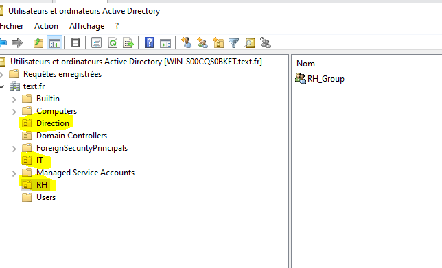
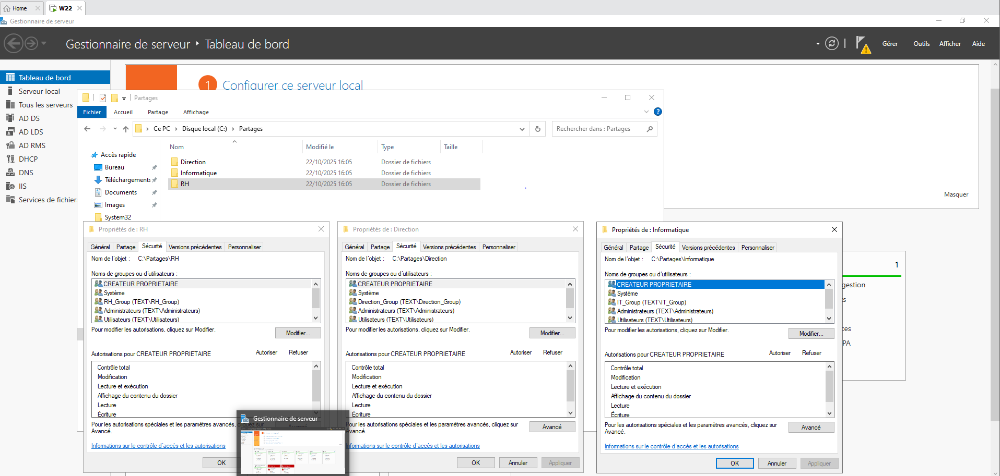

   <h1> Mise en place d’une infrastructure Active Directory, DNS, DHCP et RDS sous Windows Server<h1>
    
Mettre en place un domaine d’entreprise nommé texte.fr, structuré en unités d’organisation (OU) et groupes de sécurité, afin de gérer les utilisateurs et les ressources du réseau.

 Création du domaine texte.fr

Création de trois unités d’organisation :

Direction

RH

IT

Création des groupes associés : Direction_Group, RH_Group, IT_Group

Ajout des utilisateurs et affectation aux groupes

blabla

